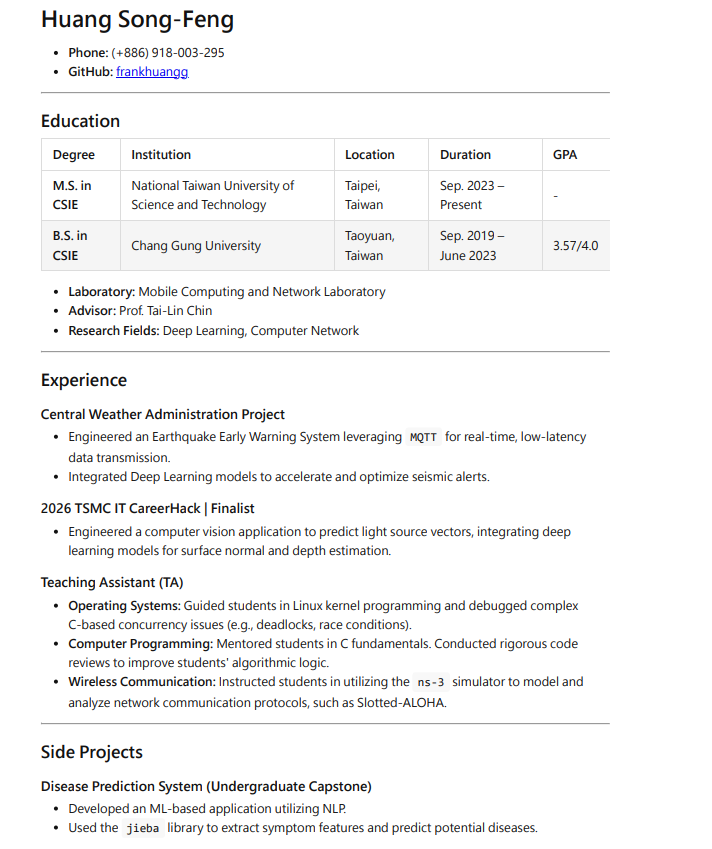

[](https://classroom.github.com/a/tniubn-f)
# HW1-Markdown-Creation-and-Rendering-Practice-Template

## 1. 專案簡介
本專案為個人學經歷履歷，內容涵蓋教育背景、專案經驗、擔任助教經歷以及專業技能。
選用的渲染工具為 **`md-to-pdf`**。

## 2. 環境需求
* **作業系統：** Ubuntu / Linux / macOS / Windows
* **所需語言 Runtime：** Node.js, npm

## 3. 安裝步驟
在Terminal中執行以下指令：

```bash
# 更新安裝 Node.js 與 npm
sudo apt-get update
sudo apt-get install -y nodejs npm

# 安裝 md-to-pdf 
sudo npm install -g md-to-pdf

# 安裝 Puppeteer 所需的 Chromium 瀏覽器
npx puppeteer browsers install chrome
```

## 4. 執行渲染
安裝完成後，於本專案根目錄，執行以下指令：

```bash
# 建立 output 資料夾
mkdir -p output

# 將 Markdown 渲染為 PDF
md-to-pdf content.md

# 將 pdf 移動至 output 資料夾內
mv content.pdf output/output.pdf
```

## 5. 預期輸出
* **輸出檔案名稱：** `output/output.pdf`
* **輸出格式：** PDF 
* **預期樣貌：** 將會產出一份的專業履歷。包含結構清晰的表格、項目符號清單，整體風格乾淨易於閱讀。


## 6. 參考資料
* [Markdown 語法教學](https://www.markdownguide.org/basic-syntax/)
* [md-to-pdf GitHub Repository](https://github.com/simonhaenisch/md-to-pdf)
* [Puppeteer Configuration Guide](https://pptr.dev/guides/configuration)